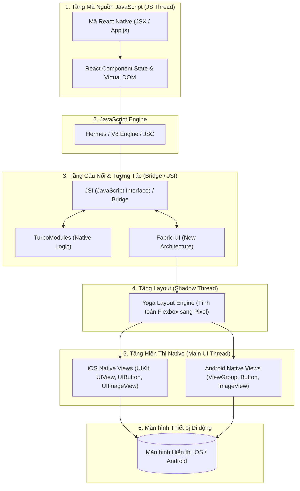
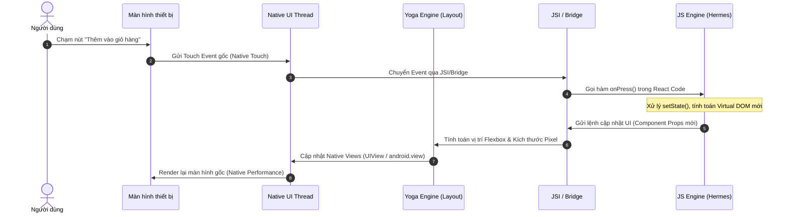

# Bài tập 3: Mô Tả Quy Trình Hoạt Động & Kiến Trúc React Native

---

## 1. Sơ Đồ Quy Trình Hoạt Động Nguyên Lý Kiến Trúc React Native

### A. Sơ đồ Tổng quan Kiến trúc (High-Level Architecture)

---

### B. Sơ đồ Luồng Tuần Tự khi Người Dùng Thao Tác (Sequence Diagram)

---

## 2. Thuyết Minh Quy Trình Hoạt Động Chi Tiết từ Mã JS Đến Màn Hình

Quy trình hoạt động của React Native diễn ra theo **5 bước chính** nối tiếp nhau:

### 🔹 Bước 1: Khởi Chạy & Biên Dịch Mã JavaScript
- Lập trình viên viết mã ứng dụng bằng JavaScript/TypeScript (sử dụng các thành phần như `<View>`, `<Text>`, `<FlatList>`, `<Image>`).
- Khi ứng dụng khởi chạy, **JavaScript Engine** (mặc định là **Hermes Engine** do Meta tối ưu hóa riêng cho React Native, hoặc JavaScriptCore/V8) sẽ đọc, thông dịch và thực thi mã JS trên một luồng riêng biệt gọi là **JS Thread**.

### 🔹 Bước 2: Tạo Cây Virtual DOM & Cập Nhật Trạng Thái
- Khi mã JS thực thi, React tạo ra một cây giao diện ảo (**Virtual DOM**).
- Mỗi khi có sự kiện (như bấm nút, dữ liệu API trả về), `state` trong React thay đổi, React sẽ tính toán sự khác biệt (Diffing algorithm) để xác định xem phần tử nào cần thay đổi trên giao diện.

### 🔹 Bước 3: Đi Qua Cầu Nối (Bridge) Hoặc Giao Diện JSI (JavaScript Interface)
- **Cơ chế cũ (Classic Bridge):** Mã JS đóng gói các lệnh thay đổi UI thành dữ liệu chuỗi JSON không đồng bộ (Asynchronous JSON Messages) và gửi qua Cầu nối (Bridge).
- **Cơ chế mới (New Architecture - JSI & Fabric):** JS Engine sử dụng **JSI (JavaScript Interface)** để giữ tham chiếu C++ trực tiếp đến các đối tượng Native. Điều này cho phép mã JavaScript gọi trực tiếp các phương thức Native đồng bộ mà không cần chuyển đổi JSON, loại bỏ điểm nghẽn hiệu năng lịch sử của React Native.

### 🔹 Bước 4: Tính Toán Bố Cục Với Yoga Layout Engine (Shadow Thread)
- Dữ liệu giao diện từ JS chỉ chứa các thuộc tính bố cục dạng Flexbox (ví dụ: `flexDirection: 'row'`, `justifyContent: 'center'`).
- **Yoga Layout Engine** (bộ thư viện tính toán bố cục bằng C++ do Meta phát triển) sẽ tiếp nhận và quy đổi các thuộc tính Flexbox này thành tọa độ vị trí thực tế (`x`, `y`, `width`, `height`) chính xác tính theo Pixel trên màn hình thiết bị.

### 🔹 Bước 5: Render Giao Diện Native Thực Tế (Main UI Thread)
- Kết quả tính toán từ Yoga Engine được gửi đến **Main UI Thread** của hệ điều hành.
- Tại đây, hệ điều hành Android/iOS tạo ra và hiển thị các UI Component Native thực sự:
  - Thẻ `<View>` biến thành `android.view.ViewGroup` (Android) hoặc `UIView` (iOS).
  - Thẻ `<Text>` biến thành `android.widget.TextView` (Android) hoặc `UILabel` (iOS).
  - Thẻ `<Image>` biến thành `ImageView` (Android) hoặc `UIImageView` (iOS).

---

## 3. Vì Sao React Native Tạo Ra Trải Nghiệm Gần Giống Native Nhưng Vẫn Dùng Chung Mã Nguồn?

### 1. Không dùng WebView (Không phải Web ẩn danh)
Khác với các công nghệ Hybrid cũ (như Cordova hay PhoneGap) hiển thị giao diện qua một trình duyệt thu nhỏ (WebView), **React Native render trực tiếp các Widget Native gốc của hệ điều hành**. Người dùng chạm vào một chiếc nút trong React Native là đang chạm vào một nút bấm Native thực sự của iOS/Android.

### 2. Tách biệt Luồng Thực Thi (Multi-Threading Architecture)
- Luồng tính toán logic (JS Thread) và Luồng hiển thị giao diện (Native UI Thread) hoạt động độc lập.
- Điều này giúp cho việc cuộn danh sách (Scrolling) hoặc các hiệu ứng chuyển động animation gốc (Native Animations) vẫn mượt mà ở tốc độ **60 - 120 FPS** ngay cả khi mã JS đang bận xử lý dữ liệu ngầm.

### 3. Nguyên lý Trích Xuất Bất Biến (Abstraction Layer)
React Native đóng vai trò là một **lớp trừu tượng (Abstraction Layer)**. Nó cung cấp một bộ thành phần React chuẩn (`<View>`, `<Text>`, `<ScrollView>`) dùng chung cho lập trình viên. Đằng sau hậu trường, React Native tự động dịch chuyển bộ thành phần chuẩn đó thành code Native riêng cho iOS và Android.

 nhờ cơ chế này:
- Lập trình viên **chỉ cần viết mã 1 lần** bằng JavaScript.
- Người dùng nhận được **trải nghiệm 100% Native mượt mà**.
