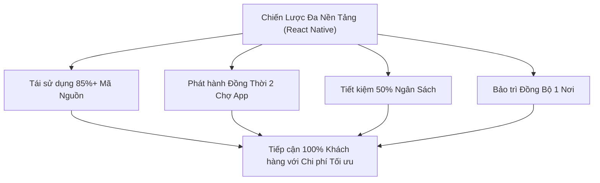

# Bài Tập Luyện Tập (Mức Trung Bình): Phân Tích Chiến Lược Phát Triển Ứng Dụng Bán Hàng Cho Doanh Nghiệp Nhỏ

---

## 1. Đặt Vấn Đề

Một doanh nghiệp nhỏ đang chuẩn bị xây dựng ứng dụng bán hàng trực tuyến để tiếp cận khách hàng mua sắm trên thiết bị di động. Câu hỏi chiến lược đặt ra là: **Doanh nghiệp có nên chỉ phát triển ứng dụng cho 1 nền tảng duy nhất (chỉ Android hoặc chỉ iOS) hay không?**

---

## 2. Phân Tích Lý Do KHÔNG NÊN Chỉ Phát Triển Cho Một Nền Tảng Duy Nhất

### 1. Mất đi một lượng lớn cơ hội tiếp cận khách hàng (Market Share Loss)
- **Thực tế thị trường:** Tại Việt Nam và trên toàn thế giới, người dùng phân bổ khá rõ rệt trên 2 hệ điều hành. Android chiếm khoảng 60%-70% (tập trung vào số đông người dùng trung cấp) và iOS chiếm khoảng 30%-40% (tập trung vào nhóm khách hàng có khả năng chi tiêu cao).
- **Hậu quả:** Nếu doanh nghiệp chỉ làm app Android, họ sẽ tự tay bỏ lỡ toàn bộ khách hàng dùng iPhone (nhóm khách hàng có tỷ lệ mua sắm đơn hàng cao). Ngược lại, nếu chỉ làm app iOS, doanh nghiệp sẽ mất đi 70% lượng người dùng di động phổ thông.

### 2. Tăng chi phí gấp đôi nếu phát triển riêng từng phiên bản Native sau này
- Nếu ban đầu làm 1 hệ điều hành bằng Native Code (ví dụ chỉ làm Android bằng Kotlin), sau này khi muốn mở rộng sang iOS, doanh nghiệp sẽ phải:
  - Thuê một đội ngũ lập trình viên Swift/iOS hoàn toàn mới,
  - Xây dựng lại toàn bộ ứng dụng từ con số 0 trên Xcode,
  - Chi phí nhân sự và thời gian bị dội lên **gấp đôi** (200%).

### 3. Phức tạp & Khó khăn trong quản lý và bảo trì (Maintenance Nightmare)
- Khi phát triển 2 ứng dụng riêng biệt, mỗi khi có chương trình khuyến mãi, thay đổi bảng giá, hoặc cập nhật giao diện mới, doanh nghiệp phải yêu cầu 2 nhóm dev làm việc độc lập.
- Điều này dễ dẫn đến tình trạng bất đồng bộ: Phiên bản Android đã cập nhật tính năng mới nhưng iOS bị chậm lịch 2 tuần, hoặc trải nghiệm người dùng giữa 2 máy bị lệch nhau.

---

## 3. Lợi Ích Lớn Từ Việc Lựa Chọn Hướng Phát Triển Ứng Dụng Đa Nền Tảng (Cross-Platform)

Lựa chọn công nghệ đa nền tảng (như **React Native**) đem lại các lợi ích vượt trội cho doanh nghiệp nhỏ:

1. **Phủ sóng 100% Khách hàng tiềm năng:** Đưa ứng dụng xuất hiện cùng lúc trên cả Apple App Store và Google Play Store.
2. **Tiết kiệm 40% - 50% Chi phí:** Chỉ cần 1 đội ngũ lập trình viên thạo JavaScript/React Native là có thể xây dựng ứng dụng hoàn chỉnh cho cả 2 hệ điều hành.
3. **Bảo trì đồng bộ & Nhanh chóng:** Sửa lỗi và nâng cấp ứng dụng ở 1 bộ code duy nhất. Có thể cập nhật giao diện khuyến mãi ngầm (Over-The-Air) trực tiếp xuống máy khách hàng trong vài phút.

---

## 4. Kết Luận Khuyên Dùng Cho Doanh Nghiệp
Đối với doanh nghiệp nhỏ có kinh phí giới hạn và cần tối ưu hiệu quả kinh doanh, **phát triển ứng dụng đa nền tảng bằng React Native là quyết định tối ưu nhất**, giúp doanh nghiệp cân bằng giữa bài toán chi phí và khả năng mở rộng thị trường.
